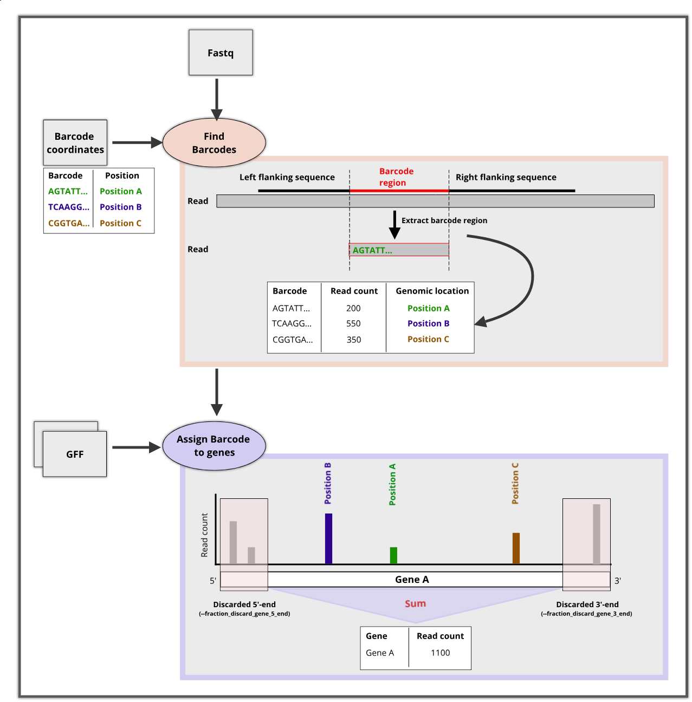

# TransposonCount

The tool takes a fastq file and a barcode coordinate file to assign the barcode to the sequenced reads. The barcode coordinates are mapped to the supplied gene annotation and read counts are summed per annotated region.


## Workflow




## How to run transposon count?

```
> python3 count_transposon_barcodes.py --help

Count transposon mutant libraries

optional arguments:
  -h, --help            show this help message and exit
  -f FILE [FILE ...], --fastq_files FILE [FILE ...]
                        Fastq file (one ore more) (default: None)
  -c FILE, --barcode_coordinate_file FILE
                        Barcode coordinate file (default: None)
  -g FILE [FILE ...], --gff_files FILE [FILE ...]
                        GFF3 gene annotation file (one ore more) (default: None)
  -o FILE, --output_file FILE
                        Output file (default: None)
  -a FILE, --output_annotated_gff_file FILE
                        Output file of generated GFF file (default: None)
  --log_file FILE      Output of count statistic (default: count_statistic.txt)
  -l SEQUENCE, --left_flanking_sequence SEQUENCE
                        Sequence flanking the 5'-region of the barcode in each read (default: ACTCACTATAGGGAGACCGGCCT)
  -r SEQUENCE, --right_flanking_sequence SEQUENCE
                        Sequence flanking the 3'-region of the barcode in each read (default: CAGGGTTGAGATGTGTATA)
  -3 FLOAT, --fraction_discard_gene_3_end FLOAT
                        3'-end fraction to ignore for each gene (default: 0.1)
  -5 FLOAT, --fraction_discard_gene_5_end FLOAT
                        5'-end fraction to ignore for each gene (default: 0.1)
  -t INT, --threads INT
                        Number of threads (default: 4)
  -s, --silent          Supress any intermediate output (default: False)
```


## Input files

### Fastq file(s)  (`--fastq_files`)

The sequenced library containing the barcode sequences.


### Barcode coordinate file  (`--barcode_coordinate_file`)

The barcode coordinates file must be a four column tabular file with the following contents:

| Column                                              | 	Description |
|:----------------------------------------------------|-----------------|
| 1	|Barcode sequence                                  |
| 2	|Sequence Id: The name of the genome, plasmid, ... |
| 3	|Strand: either '+' or '-'                         |
| 4	|Genomic position                                  |

Example:

|Barcode	|Sequence ID	|Strand	|Genomic position|
|:----------|---------------|-------|----------------|
|TCAATCCAACTAACCCC|	NC_011294.1|	+	|125|
|GTGACACATATAGCCGGG|	NC_011294.1|	-	|158|


### Gene annotation(s)  (`--gff_files`)

Multiple GFF files can be specified. Only gene annotations with type 'gene' are used. Intergenic regions between the subsequent genes are automatically incorporated.

> [!IMPORTANT]
> The sequence identifier(s) must match the identifiers used in the barcode coordinate file!

## Output files

### Gene insertions  (`--output_file`)

The gene insertion output file contains the following output:

|Column| Name 	                                                                                                                           | Description                                                                                                              |
|------|----------------------------------------------------------------------------------------------------------------------------------|:-------------------------------------------------------------------------------------------------------------------------|
|1| 	locus_tag                                                                                                                       | The locus_tag of the annotated region                                                                                    |
|2| 	gene_name| The name of the annotated region if present. Else the 'Name' attribute is used.                                          |
|3| 	ncra|                                                                                                                          |
|4| 	start| Start position of the annotated region                                                                                   |
|5| 	end| End position of the annotated region                                                                                     |
|6| 	strand| 1 for '+'; -1 for '-'                                                                                                    |
|7| 	read_count| The number of reads that could be assigned to the annotated region. They can be derived from multiple barcode positions. |
|8| 	ins_index| Unique insertion sites sites divided by gene length (Insertion index)                                                    |
|9| 	gene_length| The length of the annotated region                                                                                       |
|10| 	ins_count| Number of unqiue insertion sites                                                                                         |
|11| 	fcn|  Fully qualified name, which is again the gene name (to fit the requirements of Tradis)                                  |

Example:


|locus_tag|	gene_name|	ncrna|	start|	end|	strand|	read_count|	ins_index|	gene_length|	ins_count|	fcn|
|---------|----------|-------|--------|-----|----------|-----------|----------|------------|-------------|-----|
|SEN_RS00010|	thrA|	0|	101|	2563|	1|	2039|	0.002843|	2462|	7|	thrA|


> [!NOTE]
> The output is designed to be used in the downstream analysis of the Tradis-Tool package.


### GFF file  (`--output_annotated_gff_file`)

Output file name of the GFF file with the used gene annotations as well as the calculated intergenic regions.


### Log file (`--log_file`)

It contains a simple count overview of the reads and barcode assignments.

Example:
```
Total number of reads:	1.320.057

Reads without barcode assignment:	200.266
Reads with barcode assignment:	1.119.791

Used barcodes:	104.861
	Assigned to genes:	86.123
	Assigned to intergenic regions:	18.738
Discarded barcodes:	22.192
```

- **Total number of reads**: The number of reads contained in all provided fastq files
- **Reads without barcode assignment**: The number of reads that could not be assigned to a barcode
- **Reads with barcode assignment**: The number of reads that could be assigned to a barcode

- **Used barcodes**: The number of barcodes that were found in the library.
- **Assigned to genes**: The number of barcodes that map to annotated genes.
- **Assigned to intergenic regions**:	The number of barcodes that map to intergenic regions

- **Discarded barcodes**: Barcodes that were discarded because they are at the beginning or end of the gene range that is not considered. (see *--fraction_discard_gene_3_end* and *--fraction_discard_gene_5_end*) 

## Parameters

`--left_flanking_sequence`: Sequence that flanks the left-hand side of the barcode sequence. The sequence is searched from the beginning of the reads. If the sequence is found, the first part up to the end of the flanking sequence of the read is ignored for barcode identification.

`--right_flanking_sequence`: Sequence that flanks the right-hand side of the barcode sequence. The sequence to search from the beginning of the reads. If the sequence is found, the part up to the end of the read is ignored for barcode identification.

`--fraction_discard_gene_5_end`: Define the fraction (0.0 - 1.0) of the 5'-end that is discarded for barcode assignment and read counting. Ignored for intergenic regions.

`--fraction_discard_gene_3_end`: Define the fraction (0.0 - 1.0) of the 3'-end that is discarded for barcode assignment and read counting. Ignored for intergenic regions.

`--threads`: Number of processes to use [default: 4]

`--silent`: Supress any command line output

> [!NOTE]
> The discarded portions at the 3' and 5' ends are only used for annotated genes and are ignored for intergenic regions